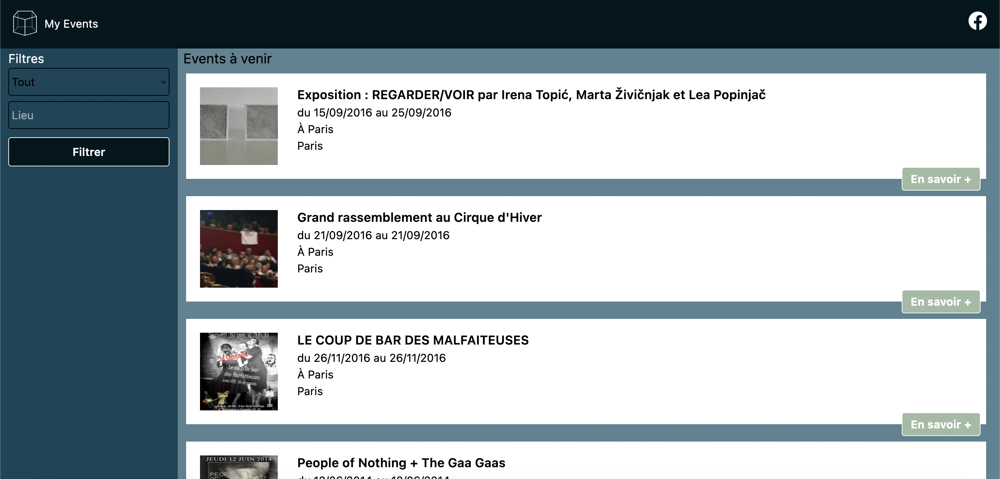
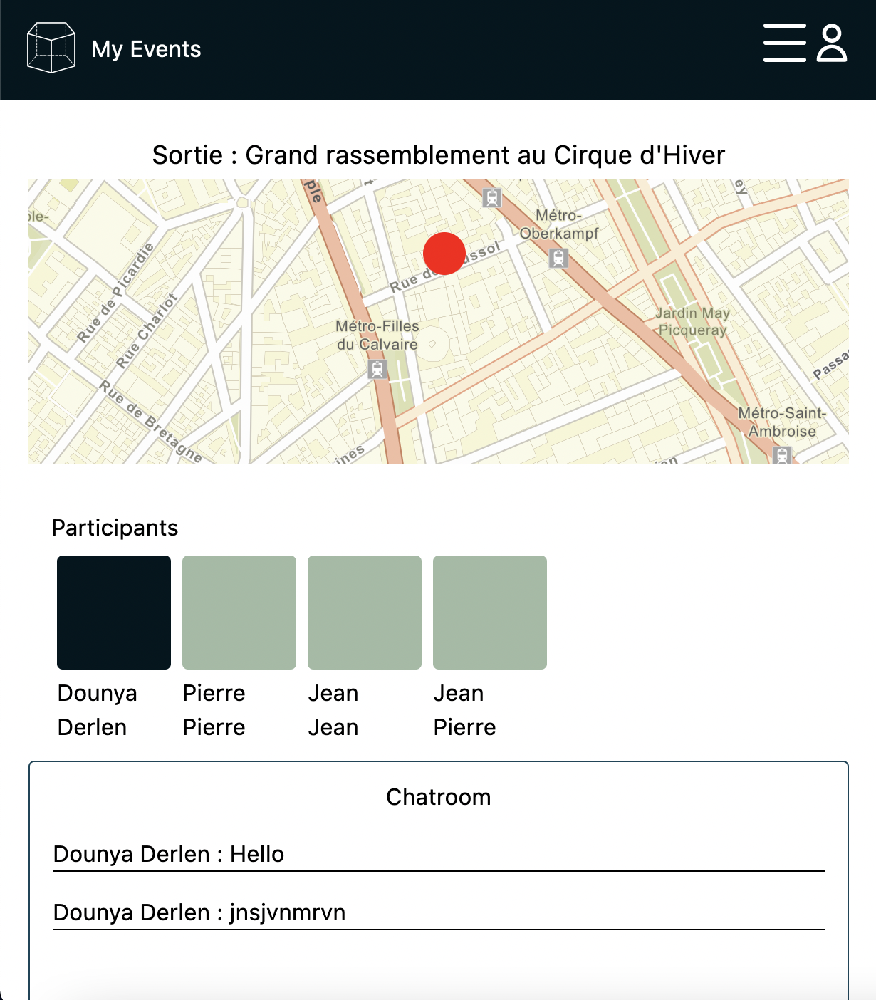

<h1 align="center">My Events</h1>

service pouvant lister des évenements à partir d'une API publique et organiser des sorties entre amis

projet de groupe réalisé avec <a href="https://github.com/CorentinNrd" target="_blank"><strong>Corentin Nordmann</strong></a> dans le cadre d'une formation

<h2>Les technos</h2>

API => <a href="https://public.opendatasoft.com/explore/dataset/evenements-publics-cibul/table/?disjunctive.tags&disjunctive.placename&disjunctive.city">OpenAgenda</a>

 

<h2 align="center">Installation</h2>
A venir

<h2 align="center">Présentation du projet</h2>

  
Lister les évènements d'un agenda public, dans un premier temps par votre position (par défaut Paris) avec possibilité de filtrer la liste par type d'évènement    ou par lieu. Par ailleurs, chaque événement est détaillé sur une page dédiée avec la possibilité de détailler d'organiser des sorties entre amis

  
Le site se présente en single page application, 100% responsive (bureau, tablette, téléphone)

  
 

<h3>Réseau social</h3>

Pour ce projet nous n'avons pas implémenté de connexion ou inscription classique, mais la possibilité de le faire via Facebook (uniquement pour le moment) chaque utilisateur a la possibilité de choisir un petit texte descriptif sur sa page profil et d'accéder à toutes les sorties qu'il a organisé ou auxquelles il participe privées ou publiques

<h3>Les sorties</h3>

Une fois le compte créé, l’utilisateur pourra créer des “sorties” à partir des événements récupérés sur l’api
d’OpenAgenda, puis il peut inviter des amis (d’autres utilisateurs, en indiquant leur pseudo) à cette “sortie”.
Une sortie se caractérise par :

<ul>
  <li>Un “événement”OpenAgenda".</li>
<li>Un organisateur (un utilisateur de votre service).</li>
<li>Une visibilité (publique / privé, définie par l’organisateur).</li>
<li>Des participants (d’autres utilisateurs de votre service).</li>
<li>Chaque “sortie” a une page spéciale permettant aux participants d’échanger.</li>
<li>Cette page comporte une carte indiquant le lieu de la sortie, ainsi qu’un mur de message sur lequel
chaque participant à ladite sortie pourra écrire.</li>
  <li>Par ailleurs veuillez noter que :</li>
 <ul>
    <li>Plusieurs sorties se rapportant à un même “événement OpenAgenda” mais organisées par différents
    utilisateurs peuvent être créées (quelle que soit la visibilité de chacune des sorties).</li>
    <li>Pour une “sortie privée” les participants doivent être ajoutés exclusivement par l’organisateur, pour
    une sortie publique, tout le monde peut s’y ajouter librement.</li>
    <li>Tous les utilisateurs peuvent se retirer d’une sortie (quelle que soit la visibilité de la sortie), si
    cet utilisateur est l’organisateur, alors la sortie est annulée.</li>
    Sur le profil des utilisateurs on retrouvera une liste des sorties publiques auxquelles ils participent, si
    l’on visite son propre profil, toutes les sorties auxquelles il participe seront listées.</li>
  </ul>
</ul>

NB: nous avons implémenté une petite fenêtre météo sur la page d'une sortie organisée qui affiche le temps local du lieu de la sortie

